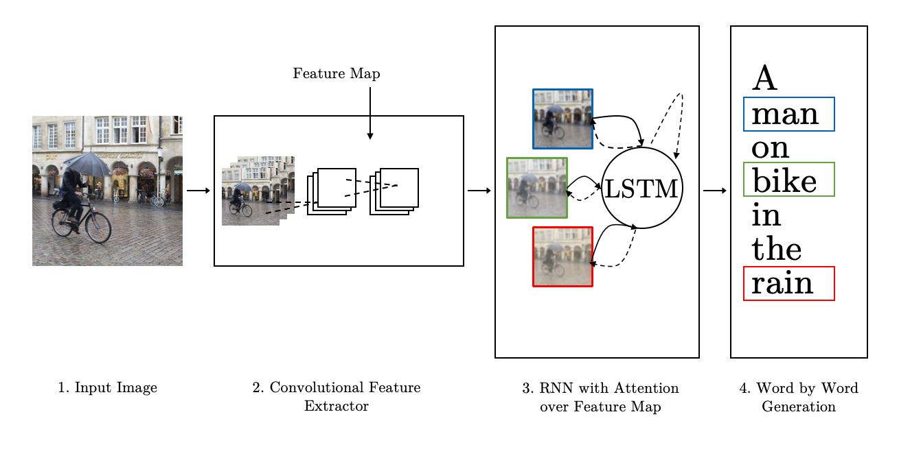

# Image-to-Text Generator

The chosen approach used for image caption generation is a variant of this Self-Critical Sequence Training based on the [Image Captioning](https://github.com/ruotianluo/ImageCaptioning.pytorch) by Ruotian Luo


model Att2in 


## Requirements
- Python 3
- PyTorch 1.3+ (along with torchvision)
- additional Requirements can be found in the requirements.txt


## Application

- Store the files desired to generate captions from in the ***test_images*** folder


- There are two options to run the code: 

    >>> Build_own_Captions.ipynb
    
    ```bash
    $ python3 eval.py --model model/model.pth --infos_path model/infos.pkl --image_folder test_images --num_images -1

    ```
    
- Use `--num_images -1` to process all images

- The generated captions are stored under ***vis/vis.json*** 

- Delete the ***eval/*** folder after each run

## Notes

This is one of three components for the Masterthesis **Explore the Gap: Deep Learning for Textual and Visual Sentiment Analysis**

- This repository is forked from the **Image Captioning codebase** by Ruotian Luo[link](https://github.com/ruotianluo/ImageCaptioning.pytorch) 

- This codebase offers multiple image captioning architectures as well as pretrained models [MODEL_ZOO.md](https://github.com/ruotianluo/ImageCaptioning.pytorch/blob/master/MODEL_ZOO.md)

- The architecture source code is the Att2in model [link](https://github.com/ruotianluo/ImageCaptioning.pytorch/blob/master/captioning/models/AttModel.py)

- Att2in is from Self-critical Sequence Training for Image Captioning https://arxiv.org/abs/1612.00563

- Check out [MODEL_ZOO.md](MODEL_ZOO.md) for Model selection and select model.pth and info.pkl in the model-folder


## Reference

```
@article{luo2018discriminability,
  title={Discriminability objective for training descriptive captions},
  author={Luo, Ruotian and Price, Brian and Cohen, Scott and Shakhnarovich, Gregory},
  journal={arXiv preprint arXiv:1803.04376},
  year={2018}
}
```
